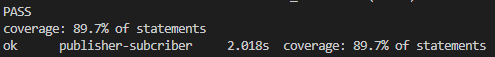

# Questão 1 - Desafio PubSub

Bem-vindo ao meu repositório! Este é um guia rápido para ajudá-lo a começar a usar o projeto.

## Pré-requisitos

Certifique-se de ter os seguintes requisitos instalados em seu sistema:

- [Go 1.21.4 ou superior](https://golang.org/doc/install)
- [Make](https://www.gnu.org/software/make/) (Automação de Tarefas)

## Configuração

Siga as estapas abaixo para configurar e executar o projeto:

1. Clone o repositório:

   ```bash
   git clone https://github.com/CarlosEduardoPereiraMarques/teste-studio-sol.git
   ```

2. Navegue até o diretório do projeto:

   ```bash
   cd solucao/questao-1/pubsub
   ```

3. Executar a aplicação:

   ```bash
   make run
   ```

## Testes

Para executar os testes, utilize o seguinte comando:

```bash
make test
```

Isso irá rodar todos os testes no seu projeto Go.

A cobertura dos testes está em 89.7%, como podemos observar na imagem abaixo:

