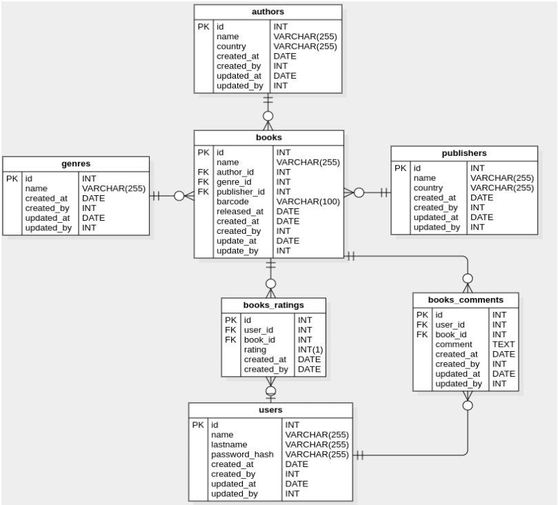

# Questão 2

Para as próximas perguntas, por favor considere o modelo relacional abaixo. Leve em conta que não existem índices criados nas tabelas.



## Questão 2.1

Descreva todos os índices que você acredita serem necessários para os cenários de busca mais comuns deste schema, listando os pontos positivos e negativos dos índices que acredite necessitar de tal análise. Se possível, descreva aspectos como cardinalidade e expectativa de redução dos conjuntos de dados quando estes índices forem usados.

## Questão 2.2

Considere a query abaixo

```sql
SELECT id, released_at, name, author_id, genre_id, publisher_id
FROM books
WHERE released_at < NOW() and released_at > '2015-01-01 00:00:01'
```

Levando em conta que a tabela `books` contém milhões de linhas, liste quais medidas de otimização podem ser tomadas para reduzir o subset e agilizar a consulta.

## Questão 2.3

Considere a query abaixo

```sql
SELECT br.book_id as book
FROM books_ratings br, books b, genres g
WHERE br.book_id = b.id
AND b.genre_id = g.id
AND g.id IN (?, ?, ?, ?, ?)
GROUP BY br.book_id
ORDER BY AVG(br.rating) DESC
LIMIT 50;
```

Levando em conta que todas as tabelas envolvidas contém milhões de linhas e que esta agregação é utilizada em todos os acessos à página inicial da aplicação, liste as medidas de otimização do banco de dados que podem ser tomadas, com seus prós e contras. Lembre-se, sua solução pode levar em conta apenas o contexto do banco de dados.

## Solução

### Questão 2.1

### Tabela `authors`

1. **Índice em `name`:**
   - *Positivos:* Facilita a busca de autores por nome.
   - *Negativos:* Pode haver baixa cardinalidade se houver muitos autores com o mesmo nome.

### Tabela `genres`

1. **Índice em `name`:**
   - *Positivos:* Facilita a busca de gêneros por nome.
   - *Negativos:* Baixa cardinalidade se houver muitos gêneros com o mesmo nome.

### Tabela `publishers`

1. **Índice em `name`:**
   - *Positivos:* Facilita a busca de editoras por nome.
   - *Negativos:* Baixa cardinalidade se houver muitas editoras com o mesmo nome.

### Tabela `books`

1. **Índice em `name`:**
   - *Positivos:* Facilita a busca de livros por nome.
   - *Negativos:* Baixa cardinalidade se houver muitos livros com o mesmo nome.

2. **Índice em `author_id`:**
   - *Positivos:* Facilita a busca de livros por autor.
   - *Negativos:* Pode haver livros com o mesmo autor, resultando em cardinalidade moderada.

3. **Índice em `genre_id`:**
   - *Positivos:* Facilita a busca de livros por gênero.
   - *Negativos:* Baixa cardinalidade se houver muitos livros do mesmo gênero.

4. **Índice em `publisher_id`:**
   - *Positivos:* Facilita a busca de livros por editora.
   - *Negativos:* Baixa cardinalidade se muitos livros são publicados pela mesma editora.

5. **Índice em `released_at`:**
   - *Positivos:* Facilita a busca de livros por data de lançamento.
   - *Negativos:* Alta cardinalidade, mas pode ser útil para consultas específicas.

### Tabela `books_ratings`

1. **Índice em `user_id` e `book_id`:**
   - *Positivos:* Facilita a busca de avaliações de um usuário específico em um livro específico.
   - *Negativos:* Pode haver múltiplas avaliações do mesmo livro pelo mesmo usuário.

### Tabela `books_comments`

1. **Índice em `user_id` e `book_id`:**
   - *Positivos:* Facilita a busca de comentários de um usuário específico em um livro específico.
   - *Negativos:* Pode haver múltiplos comentários do mesmo livro pelo mesmo usuário.

### Tabela `users`

1. **Índice em `name` e `lastname`:**
   - *Positivos:* Facilita a busca de usuários por nome e sobrenome.
   - *Negativos:* Baixa cardinalidade se houver muitos usuários com o mesmo nome ou sobrenome.

### Questão 2.2
Podem ser tomadas as seguintes medidas de otimização:

1. Paginação de Resultados:

    - Se a consulta retorna uma grande quantidade de dados e o usuário final não precisa ver todos os resultados de uma vez. Isso permite a recuperação de conjuntos menores de dados por vez, reduzindo a carga do sistema.

2. Sistema de Cache de Resultados:
    - O cache de resultados pode ser implementado para armazenar temporariamente os resultados de consultas frequentes.
    - Ferramentas como Redis podem ser utilizadas para implementar um sistema de cache eficiente.

### Questão 2.3
A query fornecida parece envolver a seleção de livros com base em suas classificações e gêneros, e em seguida, agrupa os resultados pela identificação do livro, ordenando pela média das classificações de forma descendente e limitando a 50 resultados. Vamos considerar algumas medidas de otimização possíveis:

1. **Índices:**
   - **Adicionar índices nas colunas de junção e filtragem:**
     - Crie índices nas colunas utilizadas nas condições de junção e filtragem (`br.book_id`, `b.id`, `b.genre_id`, `g.id`) para acelerar o processo de busca.

2. **Refatoração da Query:**
   - **Uso de INNER JOIN explícito:**
     - Substitua a notação antiga de junção (FROM books_ratings br, books b, genres g) pela notação INNER JOIN para melhorar a clareza do código. Isso não apenas melhora a legibilidade, mas também pode ajudar o otimizador a entender melhor a intenção da consulta.

3. **Subconsultas Correlacionadas:**
   - **Utilização de Subconsultas Correlacionadas:**
     - Avalie o uso de subconsultas correlacionadas para evitar duplicações de dados e melhorar a legibilidade. Isso pode ser útil especialmente se as tabelas têm muitos dados e a consulta está retornando muitas linhas redundantes.

4. **Cache de Resultados:**
   - **Uso de Caching de Resultados:**
     - Se a página inicial não exige dados em tempo real, considere o uso de cache para armazenar os resultados da consulta por um curto período, reduzindo assim a carga no banco de dados.

#### Prós e Contras

---

- **Índices:**
  - *Prós:* Melhora a velocidade de busca.
  - *Contras:* Pode aumentar o tempo de inserção/atualização, pois os índices precisam ser mantidos.

- **Refatoração da Query e Subconsultas Correlacionadas:**
  - *Prós:* Melhora a legibilidade e a manutenção.
  - *Contras:* Em alguns casos, pode não impactar significativamente o desempenho.

- **Cache de Resultados:**
  - *Prós:* Reduz a carga no banco de dados.
  - *Contras:* Os dados podem estar desatualizados por um curto período.
