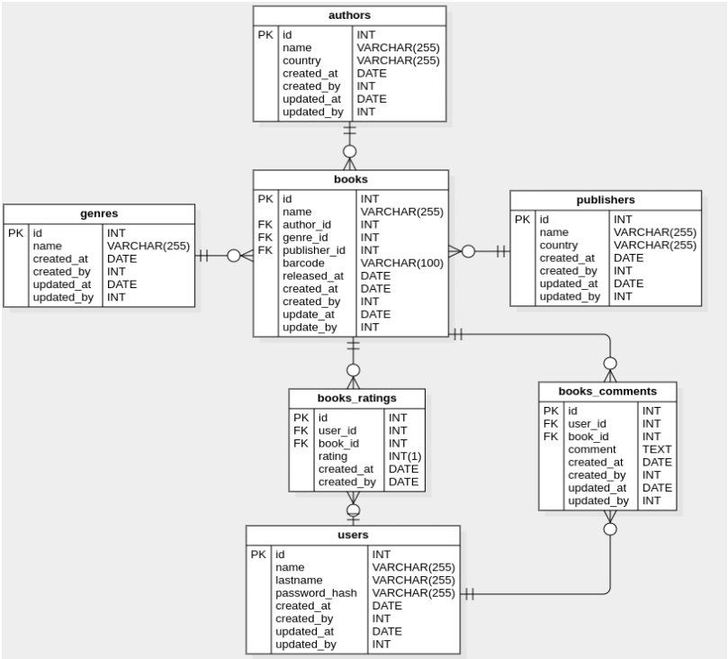

## Questão 2

Para as próximas perguntas, por favor considere o modelo relacional abaixo. Leve em conta que não existem índices criados nas tabelas.



### Questão 2.1

Descreva todos os índices que você acredita serem necessários para os cenários de busca mais comuns deste schema, listando os pontos positivos e negativos dos índices que acredite necessitar de tal análise. Se possível, descreva aspectos como cardinalidade e expectativa de redução dos conjuntos de dados quando estes índices forem usados.

### Questão 2.2

###### Considere a query abaixo:

```sql
SELECT id, released_at, name, author_id, genre_id, publisher_id
FROM books
WHERE released_at < NOW() and released_at > '2015-01-01 00:00:01'
```

Levando em conta que a tabela `books` contém milhões de linhas, liste quais medidas de otimização podem ser tomadas para reduzir o subset e agilizar a consulta.

### Questão 2.3

###### Considere a query abaixo:

```sql
SELECT br.book_id as book
FROM books_ratings br, books b, genres g
WHERE br.book_id = b.id
AND b.genre_id = g.id
AND g.id IN (?, ?, ?, ?, ?)
GROUP BY br.book_id
ORDER BY AVG(br.rating) DESC
LIMIT 50;
```

Levando em conta que todas as tabelas envolvidas contém milhões de linhas e que esta agregação é utilizada em todos os acessos à página inicial da aplicação, liste as medidas de otimização do banco de dados que podem ser tomadas, com seus prós e contras. Lembre-se, sua solução pode levar em conta apenas o contexto do banco de dados.

## Solução:

### Questão 2.1

### Questão 2.2

### Questão 2.3
