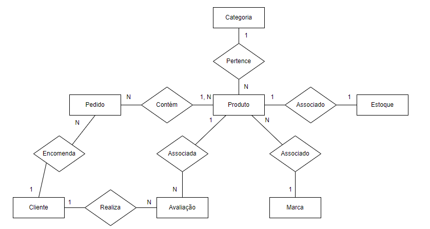

# Questão 5

Crie um diagrama entidade-relacionamento seguindo as premissas abaixo:

- O schema deve conter ao menos 7 tabelas.
- O schema deve conter todos os tipos de relacionamentos possíveis.
- O diagrama deve seguir todas as normas definidas no modelo relacional.
  A escolha do domínio usado como referência para as tabelas fica a seu critério, mas descreva uma apresentação resumida sobre ele.

## Solução

**Apresentação do Domínio: Sistema de Gerenciamento de Loja Online de Artigos de Papelaria**

*O Sistema de Gerenciamento de Loja Online de Artigos de Papelaria foi projetado para oferecer uma experiência eficiente e integrada na gestão de uma loja virtual especializada em artigos de papelaria. Vamos explorar as principais entidades e seus relacionamentos neste sistema.*

**Tabelas Principais:**

1. **Produto:** Representa os artigos de papelaria disponíveis na loja, cada um associado a uma categoria e marca específica.

2. **Cliente:** Registra informações sobre os clientes da loja, sendo fundamental para a gestão de pedidos e avaliações.

3. **Pedido:** Documenta as transações realizadas, contendo detalhes sobre os produtos adquiridos e associado a um cliente.

4. **Categoria:** Categoriza e identifica os produtos, organizando o catálogo da loja.

5. **Marca:** Categoriza e identifica os produtos organizando o catálogo da loja

6. **Avaliação:** Permite que os clientes expressem suas opiniões sobre os produtos, associando cada avaliação a um produto específico.

7. **Estoque:** Registra as entradas de produtos no estoque, mantendo uma relação direta com o produto correspondente.

**Principais Relacionamentos:**

1. **Produto e Categoria/Marca:** Estabelece a classificação e identificação de cada produto, organizando o catálogo de forma hierárquica.

2. **Avaliação e Produto/Cliente:** Permite avaliações específicas de produtos e clientes, oferecendo feedback valioso para a loja.

3. **Estoque e Produto:** Mantém um controle direto sobre a disponibilidade de cada produto na loja.

4. **Pedido e Produto/Cliente:** Registra as transações de compra, associando produtos aos pedidos e clientes correspondentes.
